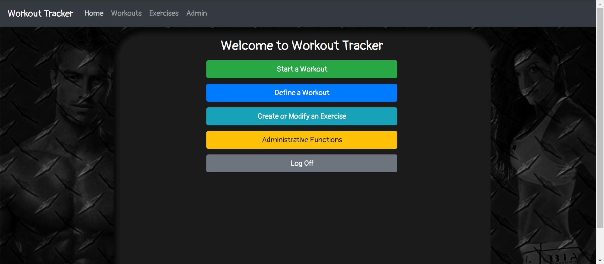
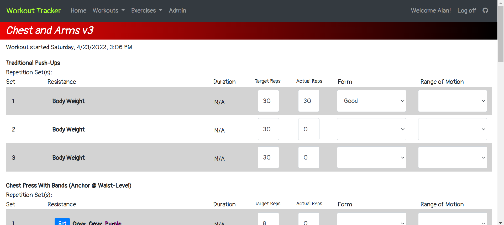
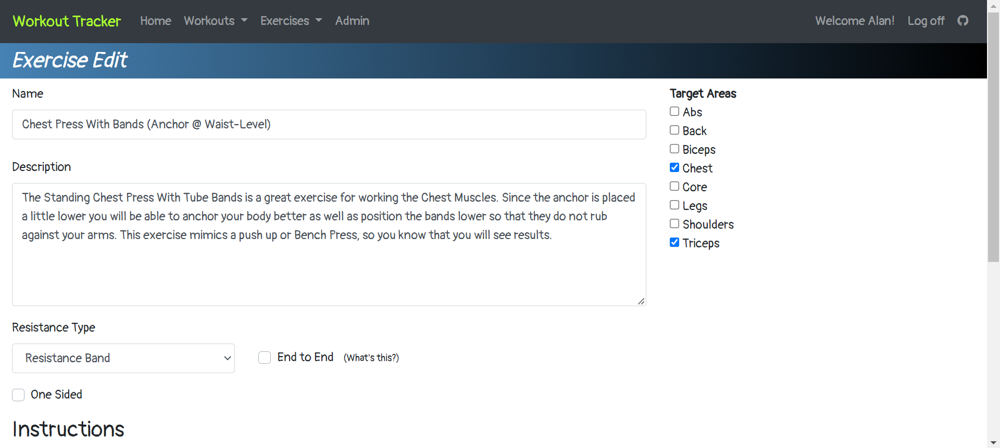
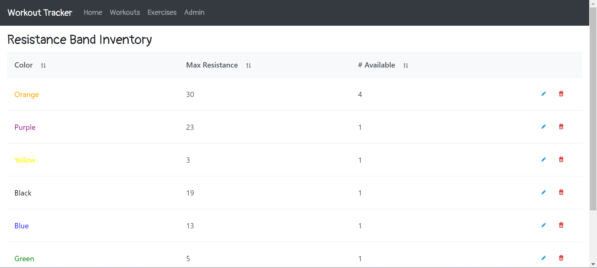

# Workout Tracker
A website for creating and tracking workouts. I wrote this to replicate and expand upon a pen and paper system I've been using for a few years.
Currently intended for use in a private, in-home network, though I may expand it later to make use of a secure token service for hosting outside of a secure, private network.

  

  

  

  
