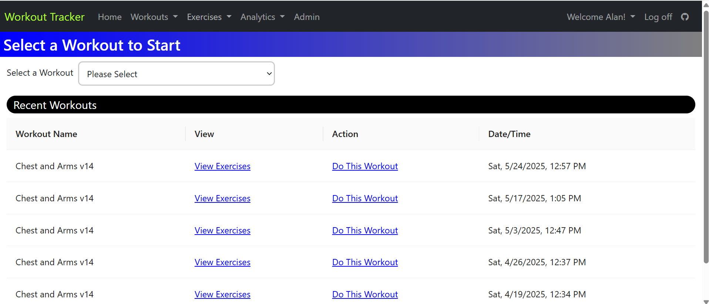
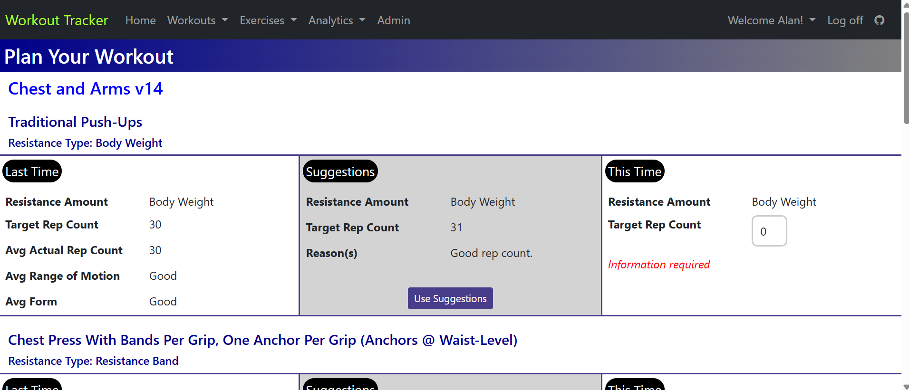
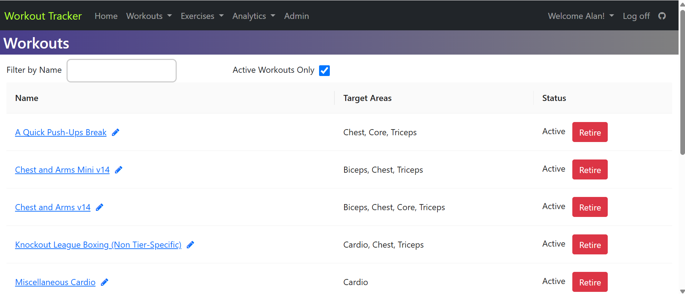
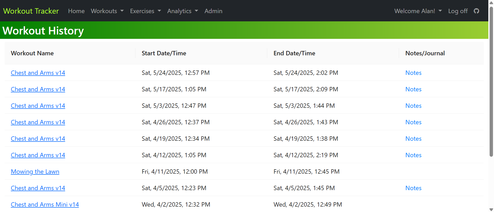
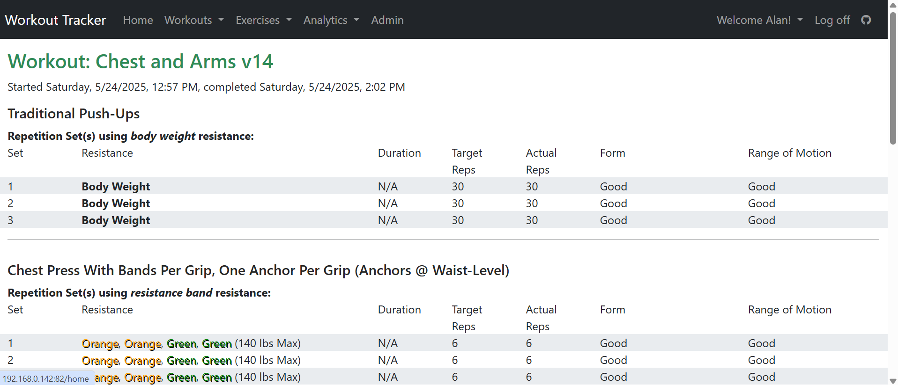
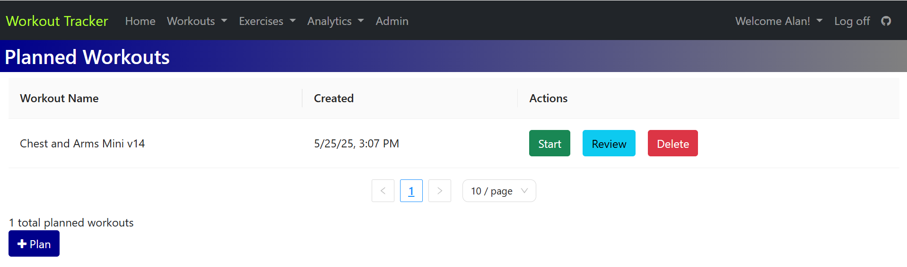
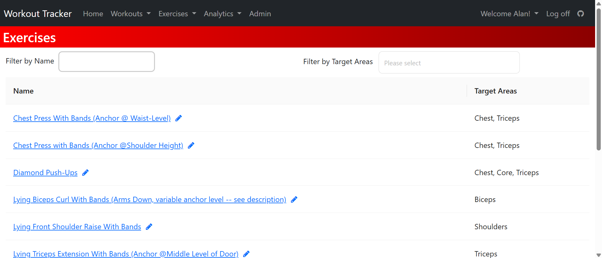
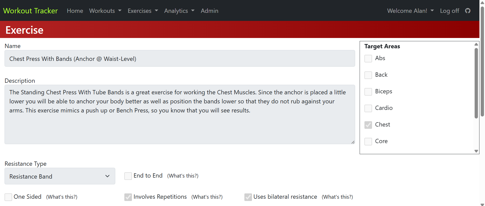
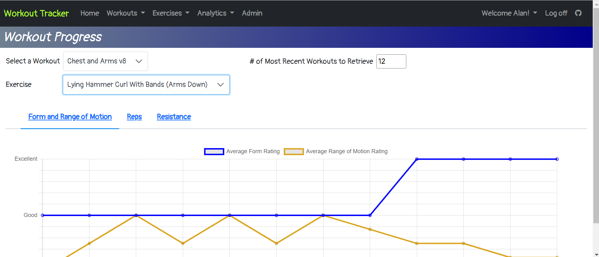

# Workout Tracker
A website for creating and tracking workouts. I wrote this to replicate and expand upon a pen and paper system I've been using for a few years. Currently intended for home use inside a private network.

  

  

  

  

  

  

  

  

  

  

  

  

  
